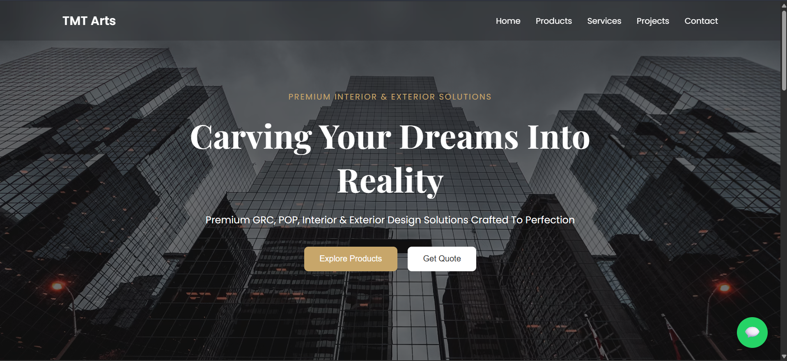
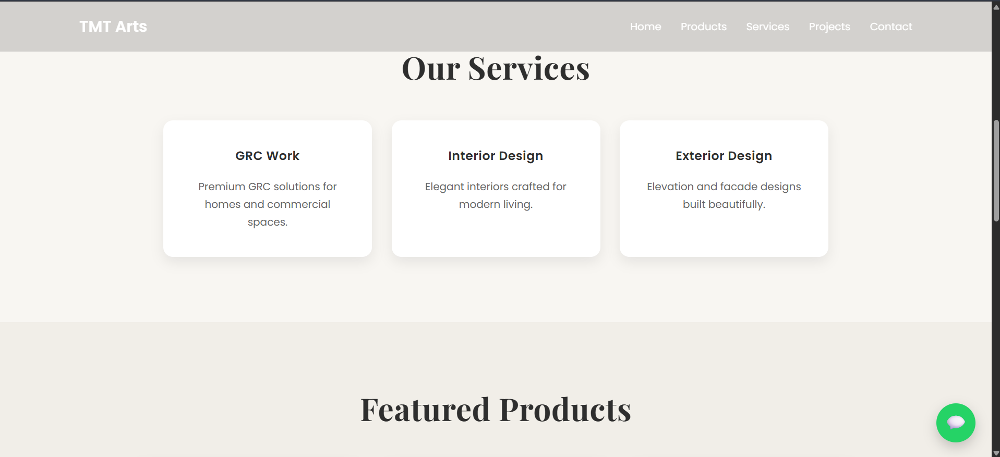
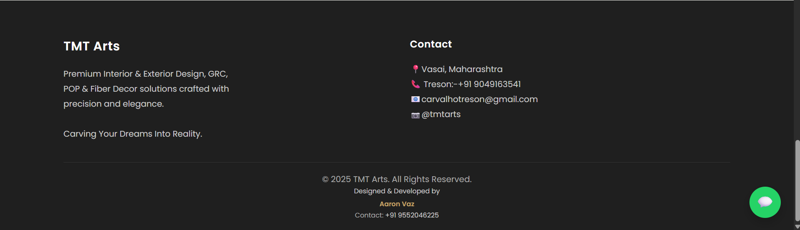

# TMT Arts

A modern, responsive business website built for **TMT Arts**, showcasing premium GRC, Interior Design, Exterior Design, POP, and Decorative Solutions.

## 📸 Website Preview

### 🏠 Home



---

### 🛠️ Services



---

### 📞 Contact



---

## ✨ Features

- Modern responsive UI
- Hero landing section
- Services section
- Product showcase
- Project/Transformation section
- Contact information
- WhatsApp integration
- Mobile-friendly design

## 🛠️ Tech Stack

- React.js
- Vite
- JavaScript (ES6+)
- CSS3
- HTML5

## 📁 Project Structure

```text
tmt-arts/
│
├── public/
├── screenshots/
│   ├── home.png
│   ├── services.png
│   └── contact.png
│
├── src/
│   ├── assets/
│   ├── components/
│   ├── pages/
│   ├── App.jsx
│   ├── main.jsx
│   └── style.css
│
├── package.json
├── vite.config.js
└── README.md
```

## 🚀 Getting Started

Clone the repository:

```bash
git clone https://github.com/Aaron4804/tmt-arts.git
```

Install dependencies:

```bash
npm install
```

Run the development server:

```bash
npm run dev
```

Build for production:

```bash
npm run build
```

## 🚧 Status

This project is currently under active development.

Upcoming improvements include:

- Improved product gallery
- Enhanced animations
- Additional project showcase
- UI refinements
- Performance optimization

## 👨‍💻 Developed By

**Aaron Vaz**

GitHub: https://github.com/Aaron4804

---

⭐ If you like this project, consider giving it a star.